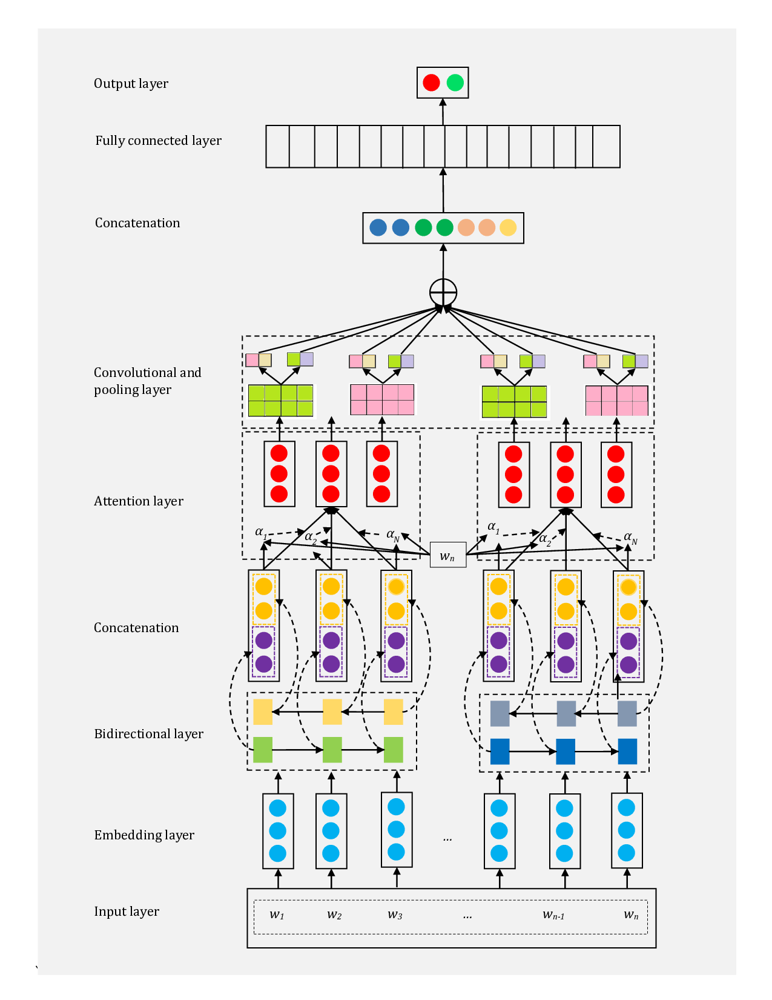
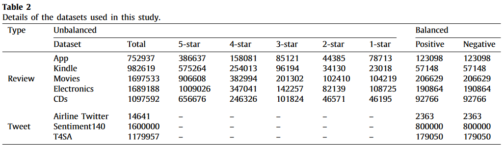

# Sentiment-Analysis-with-Deep-Learning 
This repository contains the code of the following paper: "Basiri, M. E., Nemati, S., Abdar, M., Cambria, E., &amp; Acharya, U. R. (2021). ABCDM: An attention-based bidirectional CNN-RNN deep model for sentiment analysis. Future Generation Computer Systems, 115, 279-294.".

# Abstract 
Sentiment analysis has been a hot research topic in natural language processing and data mining fields in the last decade. Recently, deep neural network (DNN) models are being applied to sentiment analysis tasks to obtain promising results. Among various neural architectures applied for sentiment analysis, long short-term memory (LSTM) models and its variants such as gated recurrent unit (GRU) have attracted increasing attention. Although these models are capable of processing sequences of arbitrary length, using them in the feature extraction layer of a DNN makes the feature space high dimensional. Another drawback of such models is that they consider different features equally important. To address these problems, we propose an Attention-based Bidirectional CNN-RNN Deep Model (ABCDM). By utilizing two independent bidirectional LSTM and GRU layers, ABCDM will extract both past and future contexts by considering temporal information flow in both directions. Also, the attention mechanism is applied on the outputs of bidirectional layers of ABCDM to put more or less emphasis on different words. To reduce the dimensionality of features and extract position-invariant local features, ABCDM utilizes convolution and pooling mechanisms. The effectiveness of ABCDM is evaluated on sentiment polarity detection which is the most common and essential task of sentiment analysis. Experiments were conducted on five review and three Twitter datasets. The results of comparing ABCDM with six recently proposed DNNs for sentiment analysis show that ABCDM achieves state-of-the-art results on both long review and short tweet polarity classification.

# Packages Used
pandas, tensorflow, keras, sklearn, numpy, matplotlib

# Highlights
A) We propose an attention-based bidirectional CNN-RNN deep model for sentiment analysis. 
B) We extract both past and future contexts by considering temporal information flow.
C) The attention mechanism allows for putting more or less emphasis on different words.
D) Experiments were conducted on five review and three Twitter datasets.
E) Our model achieves state-of-the-art results on both long and short reviews

# Proposed Architecture of ABCDM.

# Datasets

Details of the datasets used in this study: 

# Detailed Results
Detailed obtained results are available in the paper. Link to the paper: https://www.sciencedirect.com/science/article/pii/S0167739X20309195
